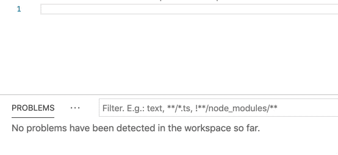

# aesophia-vscode

**NOTE:** A deployment test, not really useful yet.

Visual Studio Code plugin for the [Sophia](https://github.com/aeternity/aesophia) language, used by the [Aeternity](https://aeternity.com/) blockchain. 

The LSP part uses [aesophia-parser](https://github.com/ybin64/aesophia-parser), a Sophia parser implemented in TypeScript.

Syntax coloring originally from https://github.com/mradkov/vscode-sophia

## Example 
